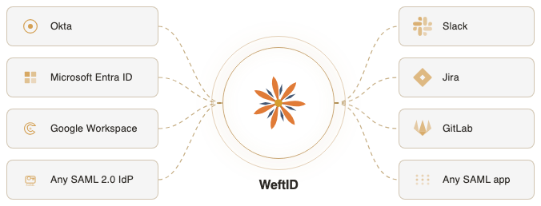

# WeftID

[](https://github.com/pageloom/weft-id/actions/workflows/code-quality.yml)
[](https://github.com/pageloom/weft-id/actions/workflows/tests.yml)
[](https://github.com/pageloom/weft-id/actions/workflows/e2e-tests.yml)

An open-source federation layer that aggregates multiple identity providers into a single, consistent interface for your applications. Open source (MIT). Optimized for self-hosting. Your infra, your data.

<picture>
  <source media="(prefers-color-scheme: dark)" srcset=".github/assets/federation-overview-dark-v2.png">
  <source media="(prefers-color-scheme: light)" srcset=".github/assets/federation-overview-light-v2.png">
  
</picture>

WeftID sits between your applications and identity systems like Okta, Microsoft Entra ID, and Google Workspace. Add or remove providers without touching application code.

No external IdP? WeftID is also a fully capable standalone identity provider with password authentication, multi-factor authentication, and user lifecycle management. Start standalone, federate later.

* **SAML 2.0 federation** -- upstream IdP integration and downstream SP registration
* **Built-in authentication** -- passwords, TOTP, email codes, backup codes
* **Hierarchical groups** -- DAG-based group model with IdP group discovery
* **Multi-tenant isolation** -- row-level security at the database layer
* **Complete audit trail** -- every action logged, exportable, with an OAuth2-secured API
* **Self-hostable** -- Docker Compose with automatic HTTPS via Caddy

[Documentation](docs/) · [Self-hosting guide](docs/self-hosting/index.md) · [Product page](https://pageloom.com/products/weft-id)

## Development

### Prerequisites

* Docker and Docker Compose
* Python 3.12+ and [Poetry](https://python-poetry.org/)
* [mkcert](https://github.com/FiloSottile/mkcert) for local TLS certificates (`brew install mkcert`)

### Setup

```bash
git clone https://github.com/pageloom/weft-id.git && cd weft-id
poetry install
./dev/mkcert.sh            # generates local TLS certs (prompts for password)
cp dev/.env.example .env
make up                    # builds and starts all services
```

Open https://dev.weftid.localhost. A dev tenant is provisioned automatically.

### Seed data

Populate a fresh database with realistic sample data (350 users, 32 groups, 5 SPs, 3 IdPs):

```bash
make seed-dev
```

Login at `https://meridian-health.weftid.localhost/login` with `admin@meridian-health.dev` / `devpass123`.

### Common commands

```bash
make test            # run unit tests (parallel)
make e2e             # run E2E tests (Playwright)
make check           # lint, format, types, compliance
make fix             # auto-fix lint/format, then check
make build-css       # rebuild Tailwind CSS
make watch-css       # auto-rebuild CSS on template changes
make watch-tests     # auto-rerun affected tests on code changes
make help            # show all targets
```

## License

[MIT](LICENSE)
