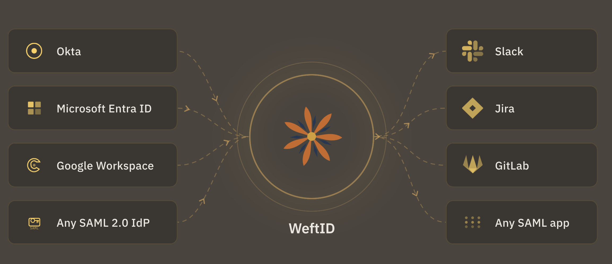

# WeftID

[](https://github.com/pageloom/weft-id/actions/workflows/code-quality.yml)
[](https://github.com/pageloom/weft-id/actions/workflows/tests.yml)
[](https://github.com/pageloom/weft-id/actions/workflows/e2e-tests.yml)

WeftID is an open-source identity federation layer that aggregates multiple identity providers into a single,
consistent interface. It acts as middleware between your applications and identity systems like Okta, Microsoft Entra
ID, Google Workspace, and other SAML-compliant providers, so applications stay simple when identity providers are
added or removed.

WeftID also works as a standalone identity provider with built-in username/password authentication, multi-factor
authentication (TOTP, email codes, backup codes), and user lifecycle management.

For more details, see [pageloom.com/products/weft-id](https://pageloom.com/products/weft-id).

<p align="center">
  
</p>

**Self-hosting?** See the [self-hosting guide](docs/self-hosting/index.md) for installation,
configuration, upgrades, and backups.

## Key Features

- **SAML 2.0 federation** with upstream IdP integration and downstream application registration
- **Built-in authentication** with username/password, MFA, and automatic user provisioning
- **Hierarchical group management** with IdP group discovery
- **Multi-tenant isolation** at the database level using row-level security
- **Complete audit trail** of all actions with a management API (OAuth2-secured)
- **SAML debugging tools** for connection testing and troubleshooting

## Setting up a dev environment

### Prerequisites

- Docker & Docker Compose
- Poetry (for local development)
- mkcert (for local TLS certificates)
  ```bash
  brew install mkcert
  ```
  **Firefox users**: Also install NSS tools for Firefox support, then re-run the cert generation script:
  ```bash
  brew install nss
  ```

### Setup Steps

1. Clone the repo

2. Install dependencies with Poetry (creates `.venv` in project root)
   ```bash
   poetry install
   ```
   **Note**: Poetry is configured to create the virtual environment in `.venv/` at the project root for easy IDE
   integration.

3. Configure your IDE
    - Point your IDE's Python interpreter to `.venv/bin/python`
    - This should auto-detect in most IDEs (VS Code, PyCharm, etc.)
    - Verify it's using Python 3.12: `poetry run python --version`

4. Generate dev-env certificates
   ```bash
   ./devscripts/mkcert.sh
   ```
   **Note**: This will prompt for your password to install the local certificate authority.

5. Generate an .env file
   ```bash
   cp .env.dev.example .env
   ```

6. Run the app
   ```bash
   make up
   ```

7. Open your browser at https://dev.weftid.localhost
   (A dev tenant has been automatically provisioned for you)

## Development Commands

### Docker Services

```bash
make up              # Build and start all services
make down            # Stop and remove containers (keep volumes)
make db-init         # Wipe DB volumes and reinitialize from scratch
make logs            # View all logs
make logs-app        # View app logs
make sh-app          # Shell into app container
```

### Testing & Code Quality

```bash
make test                                   # Run tests (parallelized by default)
make check                                  # Run all quality checks (lint, format, types, compliance)
make fix                                    # Auto-fix lint/format, then check types and compliance
```

### Frontend/CSS Development

```bash
make build-css       # Build Tailwind CSS after template changes
make watch-css       # Auto-rebuild CSS when templates change (recommended)
```

**Tip**: When actively working on templates/UI, run `make watch-css` in a separate terminal. It will automatically
rebuild the CSS whenever you modify any template file.

### Dev Seed Data

To populate a fresh database with realistic Meridian Health sample data, run:

```bash
make seed-dev
```

This creates a `meridian-health` tenant with:

- **350 users** across 8 departments (9 named admins + ~340 bulk members)
- **32 groups** in a hierarchical DAG (departments, sub-teams, cross-cutting groups)
- **5 service providers** (patient portal, HR, analytics, EHR, compliance)
- **3 identity providers** (one with a domain binding)

**Login URL:** `https://meridian-health.weftid.localhost/login`

| Account | Role |
|---------|------|
| `admin@meridian-health.dev` | super_admin |
| `admin.clinical@meridian-health.dev` | admin |
| `admin.hr@meridian-health.dev` | admin |
| *(and 6 other dept admins)* | admin |

**Password for all accounts:** `devpass123`

The script is idempotent: re-running it safely skips any resources that already exist.
