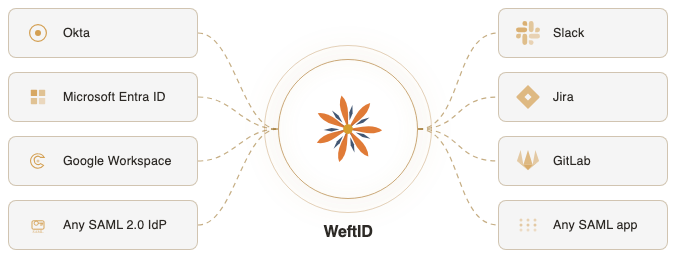

# WeftID

[](https://github.com/pageloom/weft-id/actions/workflows/code-quality.yml)
[](https://github.com/pageloom/weft-id/actions/workflows/tests.yml)
[](https://github.com/pageloom/weft-id/actions/workflows/e2e-tests.yml)

An open-source identity provider and federation layer. Aggregate multiple upstream IdPs, SAML
or OpenID Connect, into a single, consistent interface for your applications. Add or remove
providers without touching downstream apps. MIT licensed. Optimized for self-hosting. Your infra,
your data.

<picture>
  <source media="(prefers-color-scheme: dark)" srcset=".github/assets/federation-overview-dark-v2.png">
  <source media="(prefers-color-scheme: light)" srcset=".github/assets/federation-overview-light-v2.png">
  
</picture>

* **Upstream federation over SAML 2.0 and OpenID Connect** -- connect Okta, Entra ID, Google
  Workspace, or any SAML/OIDC provider, route sign-ins by email domain, provision users on
  first login, and mirror IdP attributes into WeftID profiles
* **Downstream SSO for every kind of app** -- a SAML 2.0 identity provider with per-SP signing and
  optional assertion encryption, an OpenID Provider ("Sign in with WeftID") with discovery, JWKS,
  and userinfo endpoints, and forward auth for reverse proxies (Traefik, nginx, Caddy) to protect
  apps with no native SSO
* **SCIM 2.0 provisioning in both directions** -- receive user and group lifecycle from upstream
  IdPs, and push it to downstream apps (Slack, GitHub, Atlassian, GitLab, generic SCIM) so a
  deprovisioned user loses access everywhere, not just on next login
* **Built-in authentication** -- passwords, passkeys (FIDO2/WebAuthn), TOTP, email codes, backup
  codes, and a per-tenant authentication strength policy
* **Hierarchical groups** -- DAG-based group model with IdP group sync; one group-based access
  model gates SAML, OIDC, and forward-auth apps alike
* **Multi-tenant isolation** -- row-level security at the database layer
* **Complete audit trail** -- every write logged and exportable
* **OAuth2 API** -- full REST API with authorization code and client credentials grants
* **Self-hostable** -- Docker Compose with automatic HTTPS via Caddy

[Documentation](docs/) · [Self-hosting guide](docs/self-hosting/index.md) · [Changelog](CHANGELOG.md) · [Product page](https://pageloom.com/products/weft-id)

## Self-hosting

Self-hosting WeftID is a cinch: point your domain at a server, run a one-line install script,
and Caddy handles HTTPS automatically. See the
[self-hosting guide](docs/self-hosting/index.md) for the walkthrough.

## Development

### Prerequisites

* Docker and Docker Compose
* Python 3.14+ and [Poetry](https://python-poetry.org/)
* [mkcert](https://github.com/FiloSottile/mkcert) for local TLS certificates (`brew install mkcert`)

### Setup

```bash
git clone https://github.com/pageloom/weft-id.git && cd weft-id
poetry install
./dev/mkcert.sh            # generates local TLS certs (prompts for password)
cp dev/.env.example .env
make up                    # builds and starts all services
```

Open https://dev.weftid.localhost. A dev tenant is provisioned automatically.

### Seed data

Populate a fresh database with realistic sample data (350 users, 32 groups, 5 SPs, 3 IdPs):

```bash
make seed-dev
```

Login at `https://meridian-health.weftid.localhost/login` with `admin@meridian-health.dev` / `devpass123`.

### Common commands

```bash
make test            # run unit tests (parallel)
make e2e             # run E2E tests (Playwright)
make check           # lint, format, types, compliance
make fix             # auto-fix lint/format, then check
make build-css       # rebuild Tailwind CSS
make watch-css       # auto-rebuild CSS on template changes
make watch-tests     # auto-rerun affected tests on code changes
make help            # show all targets
```

## License

[MIT](LICENSE)
